<!-- Animated typing header -->

  

---

### About Me

I'm a student focused on machine learning and full-stack web development. I'm currently learning ML fundamentals and TypeScript, and getting more comfortable with React and Node.js. I already work with JavaScript, Python, and Java, and I'm always picking up something new along the way.

I'm open to collaborating on web apps or small ML projects, especially if it's a good excuse to learn something by building it. If you want to talk about JS, TypeScript, React, or whatever I'm currently debugging in Python, feel free to reach out.

---

### Featured Projects

**[AlgoCanvas](https://github.com/HasanGMS0047/algocanvas)**
An interactive canvas that visualizes algorithms such as sorting and pathfinding step by step, so you can actually see how they work. Built with React and TypeScript.

**[Life Dashboard](https://github.com/HasanGMS0047/life-dashboard)**
A personal dashboard for tracking daily goals, habits, and productivity in one place. Built with React and Node.js.

---

### Tech Stack

  

  
  

---

### GitHub Overview

  

Generated automatically once a day by a GitHub Action in this repository, so it stays up to date without relying on a third-party server.

---

### Contact

  

  The email is <code>hasantheking007</code>, made when I was a kid and clearly convinced of my own royal status. It stuck, so I've made peace with it.

  Thanks for stopping by. Feel free to look through my repositories.

